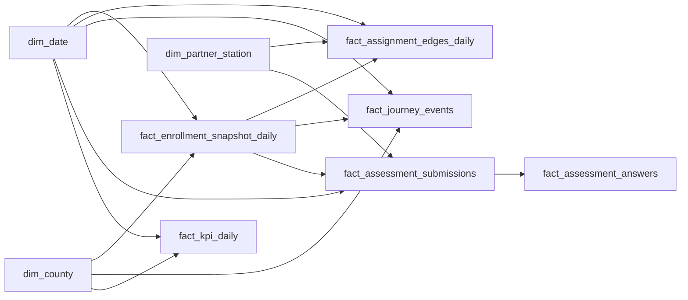

# Power BI Adaptation Plan

This guide operationalizes the ATLAS warehouse contracts into a Power BI model that is ready for:

- County Commons operational reporting
- ATLAS-INTEL performance and outcomes analytics
- Long-horizon intelligence studies (cohorts, trends, intervention impact)

## 1) Connection setup (Supabase -> Power BI)

### Supabase credentials

From Supabase dashboard:

1. `Connect` -> `Transaction pooler` -> `View parameters`
2. Capture:
   - `Host` (example: `aws-0-ap-southpole-2.pooler.supabase.com`)
   - `User` (example: `postgres.<project_ref>`)
   - Database password (project DB password)

Notes:

- Use database password, not anon key/service role key.
- If needed: `Settings` -> `Database` -> `Reset database password`.

### Power BI connection

In Power BI Desktop:

1. `Get Data` -> `Database` -> `PostgreSQL database`
2. Server: Supabase pooler host
3. Database: `postgres`
4. Credentials:
   - Username: `postgres.<project_ref>` (keep `postgres.` prefix)
   - Password: DB password

If handshake fails:

1. `File` -> `Options and settings` -> `Data source settings`
2. Select host -> `Edit Permissions`
3. Disable `Encrypt connections`
4. Retry connection

## 2) Canonical source contracts (load only these)

Load these objects first:

### Dimensions

- `atlas.v_dw_dim_county`
- `atlas.v_dw_dim_partner_station`
- `atlas.v_dw_dim_person_role_active`
- `dim_date` (Power BI date table)

### Facts

- `atlas.v_dw_fact_enrollment_snapshot`
- `atlas.v_dw_fact_assignment_edges_daily`
- `atlas.v_dw_fact_journey_events`
- `atlas.v_dw_fact_assessment_submissions`
- `atlas.v_dw_fact_assessment_answers`
- `atlas.v_dw_kpi_daily`

### Security support

- `atlas.v_dw_rls_principal_scope`

## 3) Recommended import order

1. Dimensions (`dim_*`)
2. Core operational facts (`fact_enrollment_snapshot_daily`, `fact_assignment_edges_daily`)
3. Outcome facts (`fact_journey_events`, `fact_assessment_*`)
4. Aggregate fact (`fact_kpi_daily`)
5. Security table (`v_dw_rls_principal_scope`)

Reasoning: conformed dimensions and core grain stabilize model keys before loading higher-level KPI aggregates.

## 4) Relationship map

Use single-direction filtering from dimensions to facts except where noted.



### Key relationships (explicit)

- `fact_enrollment_snapshot_daily[county_id]` -> `dim_county[county_id]` (many-to-one)
- `fact_assignment_edges_daily[enrollment_id]` -> `fact_enrollment_snapshot_daily[enrollment_id]` (many-to-one)
- `fact_journey_events[enrollment_id]` -> `fact_enrollment_snapshot_daily[enrollment_id]` (many-to-one)
- `fact_assessment_submissions[enrollment_id]` -> `fact_enrollment_snapshot_daily[enrollment_id]` (many-to-one)
- `fact_assessment_answers[assessment_submission_id]` -> `fact_assessment_submissions[assessment_submission_id]` (many-to-one)

## 5) Semantic layer foundations

Create these measure folders now so future studies remain consistent:

- `Population`
- `Workforce Capacity`
- `Access + Throughput`
- `Assessment Quality`
- `Journey Progression`
- `Study Metrics`

### Starter DAX measures

```dax
Active Enrollees :=
DISTINCTCOUNT ( fact_enrollment_snapshot_daily[enrollment_id] )

Active Navigators :=
DISTINCTCOUNT ( fact_assignment_edges_daily[navigator_person_id] )

Enrollee Navigator Ratio :=
DIVIDE ( [Active Enrollees], [Active Navigators] )

Assessment Completion Rate :=
DIVIDE (
  CALCULATE (
    COUNTROWS ( fact_assessment_submissions ),
    fact_assessment_submissions[status] = "completed"
  ),
  COUNTROWS ( fact_assessment_submissions )
)

Partner Throughput :=
DISTINCTCOUNT ( fact_assignment_edges_daily[enrollment_id] )
```

## 6) RLS implementation for County Commons and ATLAS-INTEL

Use `atlas.v_dw_rls_principal_scope` as principal-to-scope map.

### Roles

- `CountyCommonsReader`
- `AtlasIntelPartnerReader`
- `AtlasIntelOperationsReader`

### Filter strategy

- Match user identity: `LOWER(USERPRINCIPALNAME()) = v_dw_rls_principal_scope[principal_email]`
- County-scoped facts: filter by `county_id` membership
- Partner-scoped facts: filter by `partner_id` membership

Apply role filters to facts, not just visuals, so drillthrough/export remains secure.

## 7) Intelligence-study foundations (for future analysis)

Set this structure early to avoid model rewrites:

### A) Cohort specification pattern

Define reusable cohorts by:

- intake month/quarter
- county
- partner
- navigator/supervisor assignment topology
- assessment completion status

### B) Time-grain normalization

Standardize to:

- daily (`fact_*_daily`)
- monthly rollups (Power BI aggregations or downstream marts)
- quarterly trend slices for executive reporting

### C) Outcome chain

Study pipeline:

1. assignment topology exposure
2. journey event progression
3. assessment quality/completion
4. capacity/throughput outcomes

### D) Reproducibility controls

- Version measure definitions in source control.
- Keep source contracts fixed to `v_dw_*`.
- Record refresh watermark state (`dw_export_watermarks`) for every study dataset snapshot.

## 8) Performance and operations baseline

- Prefer Import mode for stable analytics performance.
- Incremental refresh policy:
  - historical partition: immutable window
  - recent partition: rolling refresh window
- Keep high-cardinality text out of relationship keys.
- Hide technical keys from report consumers; expose business labels in dimensions.

## 9) Validation checklist (go-live + recurring)

1. `fact_kpi_daily` totals reconcile with SQL (`atlas.v_dw_kpi_daily`).
2. Relationship cardinality has no ambiguous filter paths.
3. RLS validated with test principals from each role.
4. Drillthrough works county -> partner -> navigator -> enrollee where permitted.
5. Dataset refresh succeeds with expected SLA.

## 10) Immediate next build steps

1. Stand up one dataset with two report perspectives:
   - County Commons
   - ATLAS-INTEL
2. Implement starter measures from Section 5.
3. Enable RLS from Section 6.
4. Publish and run first intelligence-study template:
   - "Navigator assignment topology vs enrollee progression over time."
