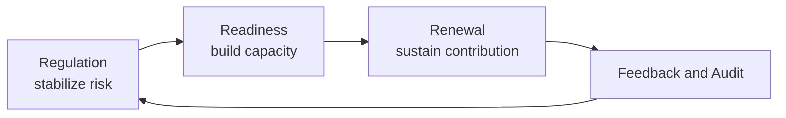
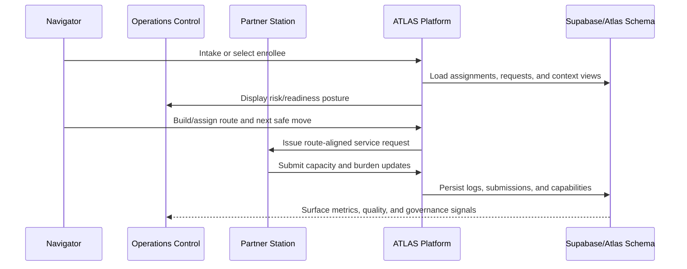
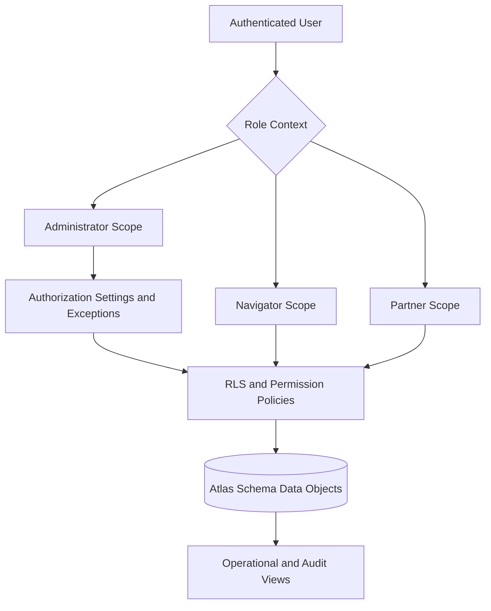

# Atlas (ATLAS)

ATLAS is a role-based care coordination and navigation platform centered on the 2026 operating model (`Regulation -> Readiness -> Renewal`), with a single-pane workflow for rapid field operations.

## Executive and Operations Brief

ATLAS is designed as an operating system for accountable care navigation, where policy, field execution, and data governance are treated as one continuous control loop. The product is intentionally structured so executive leadership can see strategic posture, operations can execute with speed and consistency, and administrators can enforce compliance without disrupting frontline throughput.

### Policy Design Intent

- **Operational safety first**: All workflows prioritize immediate stabilization and risk containment before progression.
- **Role-bound execution**: Navigator, partner, and administrator scopes are explicit and enforced.
- **Evidence-backed movement**: Progression across phases is linked to measurable outputs and logged milestones.
- **Governance by design**: Authorization, exceptions, and rollout toggles are implemented as first-class infrastructure.
- **Cross-platform continuity**: Web and mobile are aligned through shared TypeScript contracts and data wrappers.

### Strategic Achievement Snapshot

- Implemented role-based platform shell for `Navigator`, `Partner`, and `Administrator` operating contexts.
- Expanded role model to include `Supervisor` for navigator competency governance and team burden oversight.
- Established Supabase/Postgres foundation for partner capacity surveys and burden/capability updates.
- Implemented authorization foundation (`permissions`, `role_permissions`, exceptions, and policy toggles).
- Added monorepo direction for web + mobile (`Vite` + `Expo/React Native`) with shared package structure.

### System Operating Model



### End-to-End Process Flow



### Governance and Access Control Structure



## Current Product State

- Primary app shell is `src/features/atlas2026/singlepane/SinglePaneApp.tsx` via `src/RootApp.jsx`
- Standalone partner survey route is available at `/service-capacity-survey`
- Narrow/mobile route planning now uses an Metropolitan Transportation Authority (MTA)-inspired symbolic route board and applies the same visual system inside the readiness route-planning overlay
- Supabase/Postgres is active for survey and capacity workflows
- Authorization foundation is now in place (roles, permissions, user exceptions, Row-Level Security (RLS) toggles)
- Legacy Firebase paths still exist in the repo for specific 2026 services and migration continuity

## Visual Direction

The User Interface (UI) is intentionally dark and operational, not pastel/civic-light.

- Base surface: black-first (`SP_COLORS.bg = #000000`)
- Reference palette model: `references/NYC-subway-pantone-colors.jpg`
- Accent colors align with subway-inspired signal tones in `src/features/atlas2026/singlepane/theme.ts`
- Typography and casing follow the current shell behavior (including lowercase UI treatment from `src/index.css`)

## Core Workflows

- **Navigator**
  - assigned enrollees
  - requests to enroll
  - route planning with z-code-aware partner ranking
  - symbolic mobile route board for narrow-screen route inspection
  - station and county context
- **Partner**
  - service-capacity survey and burden/capability updates
  - station profile context
- **Supervisor**
  - assigned navigator oversight and competency tracking
  - navigator assessments aligned to Z-code parent themes
  - rolling weighted competency average using last three assessments (`3x most recent + 2x prior + 1x previous`)
  - supervisor shell parity: milestone strip-map and team-level radial burden view
- **Administrator**
  - admin-only operations panels
  - data controls, governance scaffolding, and policy toggles

Detailed behavior spec: `MAKE_APP_ALIVE.md`

## Technical Setup

- React 18 + Vite (web)
- Expo + React Native (mobile)
- Tailwind + Radix primitives
- Supabase JS client (`@supabase/supabase-js`) for Postgres/Application Programming Interface (API) integration
- Firebase Software Development Kit (SDK) still present for legacy/transition services
- Shared cross-platform TypeScript package at `packages/shared`

## Quick Start

```bash
npm install
npm run dev
```

Mobile app (Expo):

```bash
npm run mobile:start
```

Build and preview:

```bash
npm run build
npm run preview
```

Platform targets:

- `npm run dev:web` - web dev server (Vite)
- `npm run mobile:start` - Expo dev server
- `npm run mobile:ios` - run iOS simulator (when available)
- `npm run mobile:android` - run Android emulator/device
- `npm run mobile:web` - Expo web target

## Environment Variables

Frontend runtime (required for Supabase-connected paths):

- `VITE_SUPABASE_URL`
- `VITE_SUPABASE_PUBLISHABLE_KEY`

Security rule:

- Never expose service credentials in `VITE_*` vars.
- Keep `SUPABASE_SECRET_KEY` server-side only.

Notes:

- The client includes a compatibility fallback for `VITE_SUPABASE_ANON_KEY`.
- Non-`public` schema requests use PostgREST schema profiles (`atlas`).

Mobile runtime (`apps/mobile/.env`):

- `EXPO_PUBLIC_SUPABASE_URL`
- `EXPO_PUBLIC_SUPABASE_PUBLISHABLE_KEY`

## Database and Authorization

Start here for the current model:

- `docs/atlas-2026-database-model.md` (canonical model and authz foundation)
- `supabase/README.md` (migration order and runtime setup)
- `SQL_SCHEMA.md` (expanded schema map)

Key authz components now implemented:

- `atlas.permissions`
- `atlas.role_permissions`
- `atlas.user_permission_exceptions`
- `atlas.authorization_settings`
- `atlas.supervisor_navigator_assignments`
- `atlas.navigator_competency_assessments`
- `atlas.navigator_competency_assessment_answers`

Phased rollout toggles:

- `allow_legacy_public_partner_capacity_read`
- `allow_legacy_public_partner_capacity_write`
- `allow_legacy_public_partner_capacity_delete`

## Migrations (Current Baseline)

Apply in this sequence for a new Supabase environment:

1. `supabase/migrations/20260114_make_app_alive.sql`
2. `supabase/migrations/20260401_profile_images.sql`
3. `supabase/migrations/20260402_partner_service_capacity_surveys.sql`
4. `supabase/migrations/20260411_grant_delete_partner_service_capacity.sql`
5. `supabase/migrations/20260411_authorization_foundation.sql`
6. `supabase/migrations/20260411_supervisor_navigator_competency.sql`
7. `supabase/migrations/20260414_zcode_master_alignment.sql`
8. `supabase/migrations/20260413_atlas_app_runtime_cutover.sql`
9. `supabase/migrations/20260415_example_records_seed.sql`
10. `supabase/migrations/20260416_weighted_route_candidate_ranking.sql`
11. `supabase/migrations/20260417_route_candidate_runtime_fix.sql`

## Useful Scripts

- `npm run data:partner-capabilities` - builds partner capability seed artifact
- `npm run test:route-ranking` - validates route ranking behavior, including the three-parent Elena Rodriguez example

## Example Ranking Scenario

The seeded demo now includes a concrete weighted ranking case for `Elena Rodriguez`:

- active Z-code parents represented by child codes: `Z59.1`, `Z56.2`, `Z60.4`
- three completed partner surveys across the same codes
- expected ranking:
  1. `BridgeLine Community Commons`
  2. `North Harbor Housing Hub`
  3. `WorkSpring Employment Desk`

This scenario is intended to make the mobile route board and readiness routing overlay easy to inspect without guessing at synthetic UI-only data.

## Documentation Map

- Product behavior and execution spec: `MAKE_APP_ALIVE.md`
- Canonical 2026 technical orientation: `docs/atlas-2026-canonical-spec.md`
- Security and governance model notes: `docs/atlas-2026-security-model.md`
- Repo cutover plan: `docs/atlas-2026-repo-cutover.md`
- Seeding guide: `docs/atlas-2026-seeding.md`
- RunPod and MCP deployment handshake: `Runpod_VM.md`

## Contribution Guidance

When making changes:

- Preserve the single-pane operational interaction model unless explicitly changing IA.
- Keep role boundaries strict (navigator vs partner vs administrator).
- Treat authorization and data policy changes as migration-backed, reviewed infrastructure work.
- Update docs in the same Pull Request (PR) when behavior or architecture changes.
- Follow `docs/writing-standards.md`, including required first-use acronym expansion in every file.

