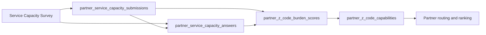
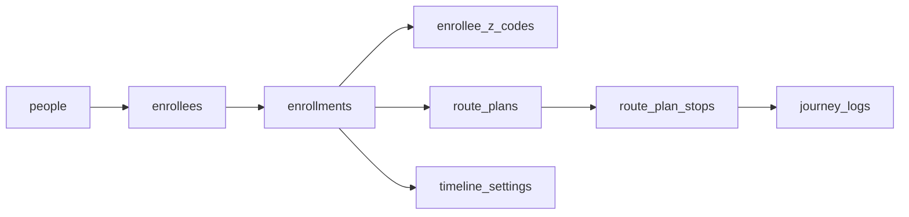
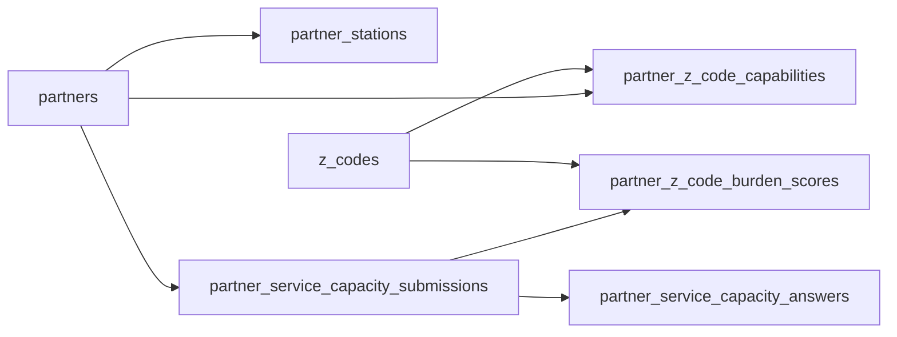

# Structured Query Language (SQL) Schema

This document summarizes the current `atlas` schema as it exists after the successful migrations and survey additions.

It is intended as a human-readable reference, not an executable migration.

## Overview

The schema is organized around 6 major areas:

1. Identity and roles
2. Geography and addresses
3. Partners and stations
4. Enrollees and enrollment lifecycle
5. Routing, referrals, and journey logs
6. Survey and capacity intelligence

## High-Level Map

```mermaid
flowchart TD
  roles[roles]
  people[people]
  peopleRoleAssignments[people_role_assignments]

  countries[countries]
  states[states]
  counties[counties]
  addresses[addresses]

  partners[partners]
  partnerStations[partner_stations]
  partnerStationIcons[partner_station_icons]

  enrollees[enrollees]
  enrollments[enrollments]
  enrollmentRequests[enrollment_requests]
  navigatorAssignments[navigator_assignments]
  enrolleeZCodes[enrollee_z_codes]
  zCodes[z_codes]
  zCodeCategories[z_code_categories]
  zCodeCategoryMap[z_code_category_map]

  routePlans[route_plans]
  routePlanStops[route_plan_stops]
  referrals[referrals]
  journeyLogs[journey_logs]
  timelineSettings[timeline_settings]
  stationMetricSnapshots[station_metric_snapshots]
  auditEvents[audit_events]
  profileImages[profile_images]

  surveySubmissions[partner_service_capacity_submissions]
  surveyAnswers[partner_service_capacity_answers]
  burdenScores[partner_z_code_burden_scores]
  partnerCapabilities[partner_z_code_capabilities]

  roles --> peopleRoleAssignments
  people --> peopleRoleAssignments

  countries --> states
  states --> counties
  countries --> addresses
  states --> addresses
  counties --> addresses

  partners --> partnerStations
  counties --> partnerStations
  addresses --> partnerStations
  partnerStations --> partnerStationIcons

  people --> enrollees
  counties --> enrollees
  people --> enrollmentRequests
  enrollees --> enrollments
  enrollments --> navigatorAssignments
  people --> navigatorAssignments
  partnerStations --> navigatorAssignments

  zCodes --> zCodeCategoryMap
  zCodeCategories --> zCodeCategoryMap
  enrollments --> enrolleeZCodes
  zCodes --> enrolleeZCodes

  enrollments --> routePlans
  people --> routePlans
  routePlans --> routePlanStops
  partnerStations --> routePlanStops
  zCodes --> routePlanStops

  enrollments --> referrals
  people --> referrals
  partnerStations --> referrals
  zCodes --> referrals

  enrollments --> journeyLogs
  routePlanStops --> journeyLogs
  people --> journeyLogs

  enrollments --> timelineSettings
  partnerStations --> stationMetricSnapshots
  people --> auditEvents
  enrollees --> profileImages
  people --> profileImages

  partners --> surveySubmissions
  surveySubmissions --> surveyAnswers
  partners --> burdenScores
  surveySubmissions --> burdenScores
  zCodes --> burdenScores
  partners --> partnerCapabilities
  zCodes --> partnerCapabilities
```

## Core Domains

### 1. Identity and role model

- `people`
- `roles`
- `people_role_assignments`

This is the base identity layer for staff, navigators, administrators, and related actors.

### 2. Geography and location

- `countries`
- `states`
- `counties`
- `addresses`

These tables support partner station locations and enrollee county alignment.

### 3. Partner network

- `partners`
- `partner_stations`
- `partner_station_icons`
- `station_metric_snapshots`

`partners` is the organization-level entity. `partner_stations` represents operational sites or service nodes.

### 4. Enrollee lifecycle

- `enrollees`
- `enrollment_requests`
- `enrollments`
- `navigator_assignments`
- `timeline_settings`
- `profile_images`

This is the core case-management side of the model.

### 5. Z-code taxonomy and enrollee pressure

- `z_codes`
- `z_code_categories`
- `z_code_category_map`
- `enrollee_z_codes`

This layer maps Z-codes into the app’s higher-level burden domains such as habitat, work, and social network.

### 6. Routing and intervention history

- `route_plans`
- `route_plan_stops`
- `referrals`
- `journey_logs`
- `audit_events`

These tables record proposed and actual pathway activity over time.

## Survey Extension

The service-capacity survey introduces 3 new survey-specific tables plus one existing normalized capability table:

- `partner_service_capacity_submissions`
- `partner_service_capacity_answers`
- `partner_z_code_burden_scores`
- `partner_z_code_capabilities`

### Survey Data Flow

### Table Roles

#### `partner_service_capacity_submissions`

Stores the raw saved survey envelope:

- respondent name
- organization name
- respondent roles
- job title
- raw payload JavaScript Object Notation (JSON)
- submission timestamps

#### `partner_service_capacity_answers`

Stores one row per survey prompt:

- parent Z-group
- displayed Z-code
- normalized Z-code
- description
- burden score from 1 to 9

#### `partner_z_code_burden_scores`

Stores the latest normalized burden score for each `(partner, z_code)` pair:

- numeric burden score
- derived relation type
- derived strength

#### `partner_z_code_capabilities`

Stores downstream partner capability interpretation used by routing:

- `specialize`
- `interfere`
- `strength`
- `source`

## Key Relationship Chains

### Enrollee journey path

### Partner capacity path

## Notable Constraints

- `partners.organization_name_normalized` is unique
- `people.external_ref` is unique
- `people.email` is nullable
- `enrollees.person_id` is unique
- `enrollment_requests.status` is constrained
- `enrollments.target_duration_months` is constrained to `6..12`
- `journey_logs.phase` is constrained to `regulation | readiness | renewal`
- `partner_service_capacity_answers.burden_score` is constrained to `1..9`
- `partner_z_code_burden_scores.burden_score` is constrained to `1..9`
- `partner_z_code_capabilities.relation_type` is constrained to `specialize | interfere`

## Practical Reading Guide

If you are exploring this schema for product work, these are the most useful starting points:

- Survey ingestion: `partner_service_capacity_submissions`
- Survey answer detail: `partner_service_capacity_answers`
- Current partner burden state: `partner_z_code_burden_scores`
- Routing interpretation: `partner_z_code_capabilities`
- Active enrollee condition set: `enrollee_z_codes`
- Journey and pathway state: `journey_logs`, `route_plan_stops`, `timeline_settings`

## Current Status

This schema now supports:

- enrollee and enrollment lifecycle management
- route planning and journey logging
- partner station capacity context
- standalone partner service-capacity surveying
- normalized partner burden and capability scoring derived from survey responses
