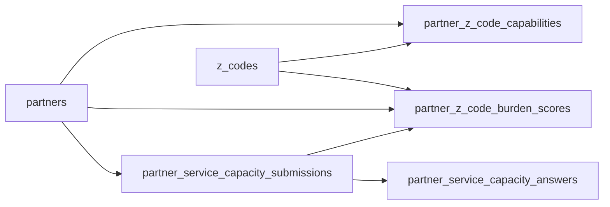

# SQL Schema Engineering Notes

This companion document is a more implementation-oriented reference for the current `atlas` schema.

It focuses on:

- table purpose
- primary keys
- important foreign keys
- notable columns
- unique constraints
- index notes

## Identity And Access

### `atlas.roles`

Purpose: canonical role registry.

- Primary key: `id`
- Unique:
  - `role_key`
- Important columns:
  - `role_key`
  - `role_name`
  - `created_at`

### `atlas.people`

Purpose: base identity record for staff and other actors.

- Primary key: `id`
- Unique:
  - `external_ref`
- Important columns:
  - `first_name`
  - `last_name`
  - `display_name`
  - `email`
  - `phone`
  - `person_type`
  - `status`
  - `created_at`
  - `updated_at`

### `atlas.people_role_assignments`

Purpose: many-to-many mapping between people and roles.

- Primary key: `id`
- Foreign keys:
  - `person_id -> atlas.people.id`
  - `role_id -> atlas.roles.id`
- Important columns:
  - `is_primary`
  - `starts_on`
  - `ends_on`
  - `created_at`

## Geography

### `atlas.countries`

Purpose: top-level country reference data.

- Primary key: `id`
- Unique:
  - `iso2`
  - `iso3`
- Important columns:
  - `country_name`

### `atlas.states`

Purpose: state/province reference data.

- Primary key: `id`
- Foreign keys:
  - `country_id -> atlas.countries.id`
- Important columns:
  - `state_code`
  - `state_name`

### `atlas.counties`

Purpose: county-level geography.

- Primary key: `id`
- Foreign keys:
  - `state_id -> atlas.states.id`
- Important columns:
  - `county_name`
  - `fips_code`

### `atlas.addresses`

Purpose: physical addresses attached to stations and potentially other entities later.

- Primary key: `id`
- Foreign keys:
  - `county_id -> atlas.counties.id`
  - `state_id -> atlas.states.id`
  - `country_id -> atlas.countries.id`
- Important columns:
  - `line1`
  - `line2`
  - `city`
  - `postal_code`
  - `latitude`
  - `longitude`

## Partner Network

### `atlas.partners`

Purpose: organization-level partner record.

- Primary key: `id`
- Unique:
  - `organization_name_normalized`
- Important columns:
  - `organization_name`
  - `organization_name_normalized`
  - `is_active`
  - `created_at`
  - `updated_at`

Engineering note:
- This is the critical join point for partner survey submissions and normalized capability scoring.

### `atlas.partner_stations`

Purpose: partner operating sites / stations.

- Primary key: `id`
- Foreign keys:
  - `partner_id -> atlas.partners.id`
  - `county_id -> atlas.counties.id`
  - `address_id -> atlas.addresses.id`
- Important columns:
  - `station_name`
  - `capacity_total`
  - `capacity_available`
  - `is_active`
  - `created_at`

Indexes:
- `idx_partner_stations_partner(partner_id)`

### `atlas.partner_station_icons`

Purpose: icon assets or slugs for partner stations.

- Primary key: `id`
- Foreign keys:
  - `station_id -> atlas.partner_stations.id`
- Important columns:
  - `icon_url`
  - `icon_slug`
  - `is_primary`

### `atlas.station_metric_snapshots`

Purpose: point-in-time station metrics for ops and load analysis.

- Primary key: `id`
- Foreign keys:
  - `station_id -> atlas.partner_stations.id`
- Important columns:
  - `snapshot_at`
  - `active_enrollments`
  - `z_codes_resolved_count`
  - `habitat_load`
  - `work_load`
  - `social_network_load`

## Enrollee Lifecycle

### `atlas.enrollees`

Purpose: enrollee master record.

- Primary key: `id`
- Unique:
  - `person_id`
  - `case_id`
- Foreign keys:
  - `person_id -> atlas.people.id`
  - `county_id -> atlas.counties.id`
- Important columns:
  - `dob`
  - `avatar_url`
  - `current_phase`
  - `created_at`
  - `updated_at`

### `atlas.enrollment_requests`

Purpose: inbound requests before acceptance/assignment.

- Primary key: `id`
- Foreign keys:
  - `person_id -> atlas.people.id`
- Important columns:
  - `submitted_at`
  - `status`
  - `source`
  - `notes`

Indexes:
- `idx_enrollment_requests_status(status)`

### `atlas.enrollments`

Purpose: active or historical enrollment episode for an enrollee.

- Primary key: `id`
- Foreign keys:
  - `enrollee_id -> atlas.enrollees.id`
- Important columns:
  - `start_date`
  - `target_duration_months`
  - `expected_end_date`
  - `status`
  - `created_at`

Engineering note:
- `expected_end_date` is maintained by trigger logic rather than a generated stored column for Supabase compatibility.

### `atlas.navigator_assignments`

Purpose: who is assigned to guide an enrollment and through which station context.

- Primary key: `id`
- Foreign keys:
  - `enrollment_id -> atlas.enrollments.id`
  - `navigator_person_id -> atlas.people.id`
  - `station_id -> atlas.partner_stations.id`
- Important columns:
  - `starts_on`
  - `ends_on`

Indexes:
- `idx_navigator_assignments_enrollment(enrollment_id)`

### `atlas.timeline_settings`

Purpose: enrollment-specific timing parameters for strip-map rendering and planning.

- Primary key: `id`
- Unique:
  - `enrollment_id`
- Foreign keys:
  - `enrollment_id -> atlas.enrollments.id`
- Important columns:
  - `plan_start_date`
  - `duration_months`
  - `regulation_cutoff_month`
  - `readiness_cutoff_month`
  - `updated_at`

### `atlas.profile_images`

Purpose: metadata for uploaded enrollee profile images.

- Primary key: `id`
- Unique:
  - `storage_path`
- Foreign keys:
  - `enrollee_id -> atlas.enrollees.id`
  - `uploaded_by_person_id -> atlas.people.id`
- Important columns:
  - `storage_bucket`
  - `public_url`
  - `mime_type`
  - `file_size_bytes`
  - `intake_source`
  - `intake_status`
  - `is_primary`
  - `metadata`
  - `created_at`
  - `updated_at`
  - `ready_at`

Indexes:
- `idx_profile_images_enrollee(enrollee_id)`
- `idx_profile_images_primary_enrollee(enrollee_id) where is_primary`

Engineering note:
- A trigger syncs the current primary image back to `atlas.enrollees.avatar_url`.

## Z-Code Taxonomy And Pressure

### `atlas.z_codes`

Purpose: canonical Z-code taxonomy table.

- Primary key: `id`
- Unique:
  - `z_code`
- Important columns:
  - `z_group`
  - `title`
  - `description`
  - `is_active`

### `atlas.z_code_categories`

Purpose: higher-level burden categories used for grouping and load mapping.

- Primary key: `id`
- Unique:
- `category_key`
- Important columns:
  - `category_name`

### `atlas.z_code_category_map`

Purpose: bridge from Z-codes to higher-level categories with weighted mapping.

- Primary key: `id`
- Foreign keys:
  - `z_code_id -> atlas.z_codes.id`
  - `category_id -> atlas.z_code_categories.id`
- Important columns:
  - `weight`

### `atlas.enrollee_z_codes`

Purpose: active and historical Z-code burden records on enrollments.

- Primary key: `id`
- Foreign keys:
  - `enrollment_id -> atlas.enrollments.id`
  - `z_code_id -> atlas.z_codes.id`
- Important columns:
  - `is_resolved`
  - `resolution_at`
  - `source`
  - `effective_at`
  - `ended_at`

Indexes:
- `idx_enrollee_z_codes_active(enrollment_id, z_code_id) where ended_at is null`

## Routing And Journey Execution

### `atlas.route_plans`

Purpose: route planning container for an enrollment.

- Primary key: `id`
- Foreign keys:
  - `enrollment_id -> atlas.enrollments.id`
  - `created_by_person_id -> atlas.people.id`
- Important columns:
  - `status`
  - `created_at`

### `atlas.route_plan_stops`

Purpose: ordered route steps linked to stations and optionally Z-codes.

- Primary key: `id`
- Foreign keys:
  - `route_plan_id -> atlas.route_plans.id`
  - `station_id -> atlas.partner_stations.id`
  - `z_code_id -> atlas.z_codes.id`
- Important columns:
  - `stop_order`
  - `assigned_date`
  - `target_date`
  - `status`

### `atlas.referrals`

Purpose: referral events between enrollment and partner station.

- Primary key: `id`
- Foreign keys:
  - `enrollment_id -> atlas.enrollments.id`
  - `referred_by_person_id -> atlas.people.id`
  - `station_id -> atlas.partner_stations.id`
  - `z_code_id -> atlas.z_codes.id`
- Important columns:
  - `status`
  - `priority`
  - `referred_at`

### `atlas.journey_logs`

Purpose: timeline events and milestones for an enrollment.

- Primary key: `id`
- Foreign keys:
  - `enrollment_id -> atlas.enrollments.id`
  - `route_plan_stop_id -> atlas.route_plan_stops.id`
  - `created_by_person_id -> atlas.people.id`
- Important columns:
  - `milestone_type`
  - `phase`
  - `label`
  - `happened_at`
  - `station_icon_slug`
  - `domains_relieved`

## Survey And Partner Capacity Intelligence

### `atlas.partner_service_capacity_submissions`

Purpose: raw service-capacity survey save envelope.

- Primary key: `id`
- Foreign keys:
  - `partner_id -> atlas.partners.id`
- Important columns:
  - `organization_name`
  - `organization_name_normalized`
  - `respondent_first_name`
  - `respondent_last_name`
  - `job_title`
  - `respondent_roles`
  - `other_role_text`
  - `form_version`
  - `raw_payload`
  - `submitted_at`
  - `created_at`
  - `updated_at`

Indexes:
- `idx_partner_service_capacity_org(organization_name_normalized, submitted_at desc)`
- `idx_partner_service_capacity_partner(partner_id, submitted_at desc)`

Engineering notes:
- This is the raw source of truth for survey saves.
- `organization_name_normalized` is the most important lookup key when no partner id is known yet.

### `atlas.partner_service_capacity_answers`

Purpose: one row per survey prompt answer.

- Primary key: `id`
- Foreign keys:
  - `submission_id -> atlas.partner_service_capacity_submissions.id`
- Important columns:
  - `prompt_id`
  - `parent_code`
  - `z_code`
  - `normalized_z_code`
  - `title`
  - `description`
  - `burden_score`
  - `created_at`

Unique:
- `(submission_id, prompt_id)`

Indexes:
- `idx_partner_service_capacity_answers_submission(submission_id)`
- `idx_partner_service_capacity_answers_z_code(normalized_z_code)`

Engineering notes:
- `z_code` preserves displayed form detail.
- `normalized_z_code` supports deduping starred or duplicate variants into the normalized model.

### `atlas.partner_z_code_burden_scores`

Purpose: latest normalized score per partner/Z-code pair.

- Primary key: `id`
- Foreign keys:
  - `partner_id -> atlas.partners.id`
  - `submission_id -> atlas.partner_service_capacity_submissions.id`
  - `z_code_id -> atlas.z_codes.id`
- Important columns:
  - `z_code`
  - `burden_score`
  - `derived_relation_type`
  - `strength`
  - `created_at`
  - `updated_at`

Unique:
- `(partner_id, z_code_id)`

Indexes:
- `idx_partner_z_code_burden_scores_partner(partner_id, updated_at desc)`
- `idx_partner_z_code_burden_scores_submission(submission_id)`

Engineering notes:
- This is the easiest table for reporting current partner burden state.
- It intentionally collapses multiple raw answers into the normalized Z-code row.

### `atlas.partner_z_code_capabilities`

Purpose: routing-oriented interpretation of partner capability by Z-code.

- Primary key: `id`
- Foreign keys:
  - `partner_id -> atlas.partners.id`
  - `z_code_id -> atlas.z_codes.id`
- Important columns:
  - `relation_type`
  - `strength`
  - `source`
  - `source_submitted_at`
  - `is_active`
  - `created_at`

Unique:
- `(partner_id, z_code_id, relation_type, source)`

Indexes:
- `idx_partner_z_capability_lookup(partner_id, z_code_id, relation_type)`

Engineering notes:
- This is the downstream table the app uses for ranking and routing logic.
- Survey saves update this table using derived `specialize` or `interfere` rows.

## Audit And Diagnostics

### `atlas.audit_events`

Purpose: generic audit/event trail.

- Primary key: `id`
- Foreign keys:
  - `actor_person_id -> atlas.people.id`
- Important columns:
  - `event_type`
  - `entity_name`
  - `entity_id`
  - `payload`
  - `created_at`

## Useful Query Anchors

If you are debugging product behavior, start from these:

- Partner survey save envelope:
  - `atlas.partner_service_capacity_submissions`
- Survey answer detail:
  - `atlas.partner_service_capacity_answers`
- Current burden normalization:
  - `atlas.partner_z_code_burden_scores`
- Current routing interpretation:
  - `atlas.partner_z_code_capabilities`
- Current enrollee burden:
  - `atlas.enrollee_z_codes`
- Journey visualization source:
  - `atlas.journey_logs`
- Timeline shape:
  - `atlas.timeline_settings`

## Survey-Focused Join Path

