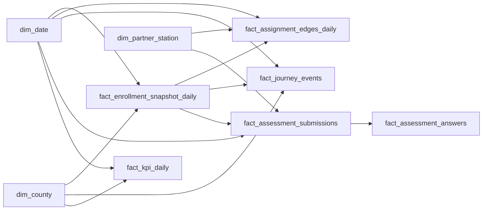

# Warehouse and Power BI Runbook (IT)

Single runbook for extracting Atlas warehouse contracts and building the Power BI semantic model (County Commons + ATLAS-INTEL).

## 1. Export contracts (load only these)

### Dimensions

- `atlas.v_dw_dim_county`
- `atlas.v_dw_dim_partner_station`
- `atlas.v_dw_dim_person_role_active`
- `dim_date` (Power BI date table)

### Facts

- `atlas.v_dw_fact_enrollment_snapshot`
- `atlas.v_dw_fact_assignment_edges_daily`
- `atlas.v_dw_fact_journey_events`
- `atlas.v_dw_fact_assessment_submissions`
- `atlas.v_dw_fact_assessment_answers`
- `atlas.v_dw_kpi_daily`

### Security support

- `atlas.v_dw_rls_principal_scope`

These objects are **service-role / warehouse-pipeline only** in the application security model. Do not grant them to ordinary authenticated app users.

Contract detail also lives in [final-erd-data-contract-pack.md](../final-erd-data-contract-pack.md).

## 2. Incremental Extract, Transform, Load (ETL)

1. Read watermark:

```sql
select last_success_at, last_cursor
from atlas.dw_export_watermarks
where pipeline_name = 'county_commons_daily';
```

2. Export changed slices using the timestamp cursor.
3. Upsert into warehouse tables by business key.
4. Commit watermark:

```sql
select atlas.fn_dw_mark_pipeline_success(
  p_pipeline_name := 'county_commons_daily',
  p_last_cursor := to_char(now() at time zone 'utc', 'YYYY-MM-DD"T"HH24:MI:SS"Z"'),
  p_metadata := jsonb_build_object('batchId', gen_random_uuid()::text, 'status', 'ok')
);
```

### Data-quality checks

```sql
select * from atlas.v_assessment_submission_parity order by assessment_type;
select * from atlas.v_assessment_answer_parity order by assessment_type;
```

## 3. Power BI connection (Supabase → Desktop)

From Supabase: **Connect → Transaction pooler → View parameters** (host, `postgres.<project_ref>` user, database password — not the anon/service Application Programming Interface (API) keys).

In Power BI Desktop: **Get Data → PostgreSQL database**. If handshake fails, edit data-source permissions and disable “Encrypt connections,” then retry.

### Recommended import order

1. Dimensions (`dim_*`)
2. Core operational facts
3. Outcome facts (`journey`, `assessment_*`)
4. Aggregate KPI fact
5. `v_dw_rls_principal_scope`

Prefer Import mode with incremental refresh (immutable historical partition + rolling recent partition).

## 4. Relationships

Use single-direction filtering from dimensions to facts except where noted.



Key relationships:

- `fact_enrollment_snapshot_daily[county_id]` → `dim_county[county_id]`
- `fact_assignment_edges_daily[enrollment_id]` → `fact_enrollment_snapshot_daily[enrollment_id]`
- `fact_journey_events[enrollment_id]` → `fact_enrollment_snapshot_daily[enrollment_id]`
- `fact_assessment_submissions[enrollment_id]` → `fact_enrollment_snapshot_daily[enrollment_id]`
- `fact_assessment_answers[assessment_submission_id]` → `fact_assessment_submissions[assessment_submission_id]`

## 5. Starter Data Analysis Expressions (DAX)

Measure folders: Population, Workforce Capacity, Access + Throughput, Assessment Quality, Journey Progression, Study Metrics.

```dax
Active Enrollees :=
DISTINCTCOUNT ( fact_enrollment_snapshot_daily[enrollment_id] )

Active Navigators :=
DISTINCTCOUNT ( fact_assignment_edges_daily[navigator_person_id] )

Enrollee Navigator Ratio :=
DIVIDE ( [Active Enrollees], [Active Navigators] )

Assessment Completion Rate :=
DIVIDE (
  CALCULATE (
    COUNTROWS ( fact_assessment_submissions ),
    fact_assessment_submissions[status] = "completed"
  ),
  COUNTROWS ( fact_assessment_submissions )
)

Partner Throughput :=
DISTINCTCOUNT ( fact_assignment_edges_daily[enrollment_id] )
```

## 6. Power BI Row-Level Security (RLS)

Use `atlas.v_dw_rls_principal_scope` as principal-to-scope map.

Roles:

- `CountyCommonsReader`
- `AtlasIntelPartnerReader`
- `AtlasIntelOperationsReader`

Filter strategy:

- Match `LOWER(USERPRINCIPALNAME())` to `principal_email`
- County-scoped facts by `county_id` membership
- Partner-scoped facts by `partner_id` membership

Apply role filters to **facts**, not only visuals, so drillthrough/export stays secure.

## 7. Validation checklist

1. `fact_kpi_daily` reconciles with `atlas.v_dw_kpi_daily`.
2. Relationship cardinality has no ambiguous filter paths.
3. RLS validated with test principals for each role.
4. Drillthrough works county → partner → navigator → enrollee where permitted.
5. Dataset refresh meets the expected Service Level Agreement (SLA).

## Related

- Blueprint: [sql-simplification-and-warehouse-blueprint.md](../sql-simplification-and-warehouse-blueprint.md)
- dbt stubs under `warehouse/dbt/` (scaffold only)
- App security: warehouse views remain service-role-only in [security-model.md](./security-model.md)
